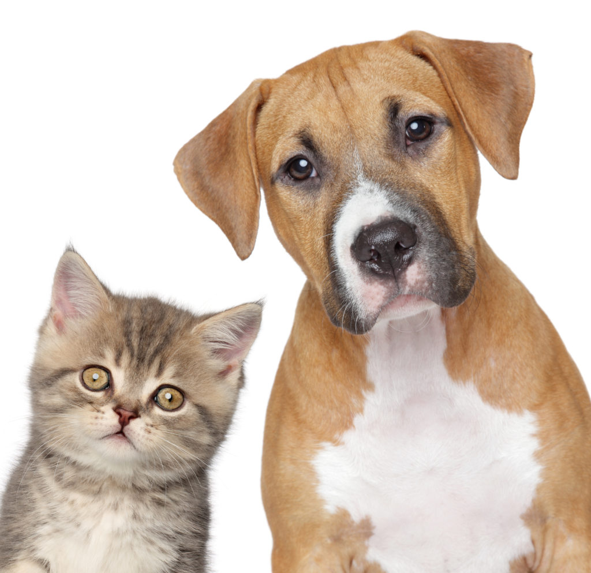

# Dogs vs Cats

Kaggle competition: https://www.kaggle.com/c/dogs-vs-cats

Dataset: http://files.fast.ai/data/dogscats.zip

## Dataset

| Class      |  Training set|  Validation set|
|-----------------|--------------|--------------|
| Dog | 11,500        | 1,000        |
| Cat | 11,500        | 1,000        |
| Total | 23,000 samples       | 2,000 samples       |

## Accuracies

| Model name      |  Accuracy on validation set|
|-----------------|--------------|
| [CNN from scratch](http://s3.picofile.com/file/8363012700/cnn_from_scratch.h5.html) | 0.8863        |
| [CNN from scratch with lower LR](http://s3.picofile.com/file/8363013842/cnn_from_scratch_lower_lr.h5.html) | 0.9220        |
| [CNN transfer learning](http://s5.picofile.com/file/8363013568/cnn_transfer_learning.h5.html) | 0.9953        |
